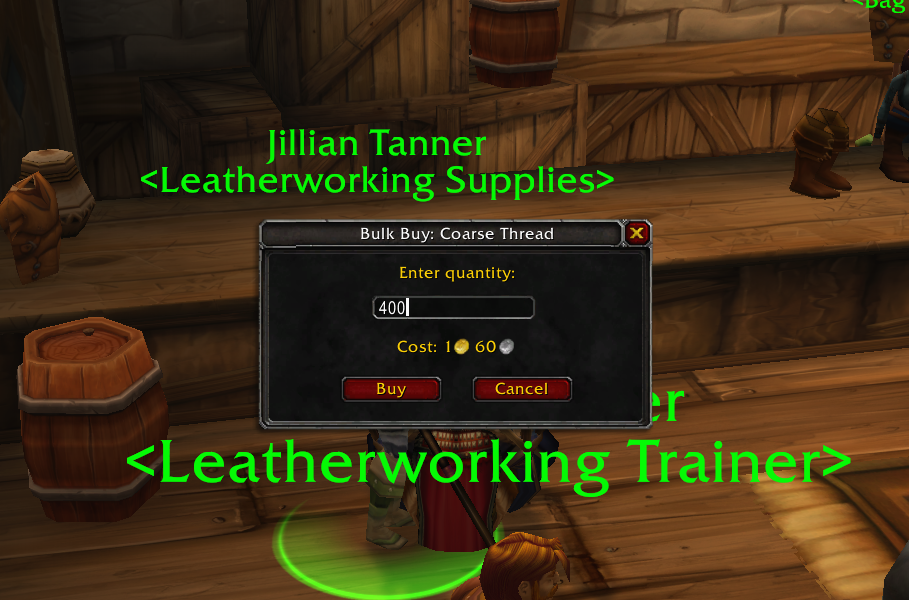

# BulkBuy Addon for World of Warcraft - README

## Overview
**BulkBuy** is a World of Warcraft addon I made so i could buy more than 20 coarse thread at a time. It allows players to input a desired quantity of an item to buy, displays the total cost dynamically, and ensures the transaction processes smoothly with delays to prevent errors.

---

## Features
1. **Custom Bulk Buy Dialog**:
   - Shift + Left-Click on a vendor item to open a custom dialog.
   - Input the desired quantity and view the total cost in real-time.
   - The dialog defaults to a quantity of `20`, which is highlighted for quick overwriting.

2. **Dynamic Cost Display**:
   - Automatically calculates the total cost based on the entered quantity.
   - Displays the cost with in-game gold, silver, and copper icons.

3. **Streamlined Controls**:
   - **Enter**: Confirms the purchase and executes the transaction.
   - **Escape**: Cancels the dialog.

4. **Error Handling**:
   - Notifies the player if there is insufficient gold or bag space to complete the purchase.
   - Adds a slight delay between purchases to avoid errors like "Item is busy."

---

## Installation
1. Download the `BulkBuy` addon.
2. Extract the folder into your World of Warcraft addons directory (`/Interface/AddOns/BulkBuy`)
3. Restart your WoW client, or type `/reload`.
4. Enable the addon in the "AddOns" menu at the character selection screen.

---

## Usage
1. Go to any vendor that sells stackable items.
2. **Shift + Left-Click** on an item to open the Bulk Buy dialog.
3. Enter the desired quantity or use the default of `20`.
4. Review the dynamically displayed cost.
5. Press **Enter** or click the **Buy** button to confirm the purchase.
6. Press **Escape** or click the **Cancel** button to close the dialog.

---

## Known Limitations
- The addon currently supports only standard vendor transactions and probably doesn't work with special currencies or extended costs.

---

## Contributing
If you encounter any issues or have suggestions for improvements, feel free to submit them via the project's repository (here) as either a PR or an issue.

---

## License
This addon is provided under the "I couldn't care any less" license. Do whatever you want with it. 